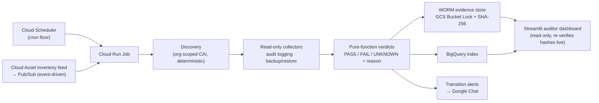

# Aegis

[](https://github.com/Vinylfigure/Aegis/actions/workflows/ci.yml)

**A deterministic compliance-evidence platform for GCP organizations (FedRAMP High + SOC 2).**

Aegis continuously collects control-tagged, **immutable** evidence across a GCP org for two
controls — *Audit Logging & Retention Integrity* and *Backup & Restore Validation* — and
**proves its own completeness and accuracy**, so an auditor can rely on the evidence by
sampling without re-verifying the collector code.

The difference from a posture scanner (Prowler et al.) is the **evidence pipeline around the
checks**: any project an auditor samples from any date answers *"is the control met, was the
population complete, and can this record be tampered with"* from the record itself.

## How it works



Every run reconciles the discovered population against the records it produced — a region
holding in-scope resources that yields no record is a **run FAIL**, never a silent omission.

## Design decisions

- **Zero LLM in the runtime.** Discovery, collection, and verdicts are deterministic Python.
  AI was used to accelerate the *build* (see [How this was built](#how-this-was-built)), never
  the evidence path.
- **Verdicts are pure functions** of the raw observation — no I/O, no clock, no randomness —
  so any verdict is **re-performable at read time** from the stored record
  ([`src/aegis/verdict/engine.py`](src/aegis/verdict/engine.py)).
- **UNKNOWN is first-class, never silent.** A permission or API error yields `UNKNOWN`, never
  a synthesized `PASS`. Losing visibility is itself alertable.
- **Evidence is immutable.** Records land in a GCS bucket under **Bucket Lock** (WORM) with a
  per-record SHA-256; the dashboard re-verifies hashes on sampled records live.
- **Collectors are read-only and idempotent** — only `get`/`list`/`describe` calls against GCP.
- **No secrets in git, no SA keys anywhere.** Runtime auth is via attached service accounts;
  CI/CD deploys keylessly with **Workload Identity Federation (OIDC)**; runtime secrets live in
  Secret Manager. CI enforces a secret scan (gitleaks) on every push.
- **Frozen evidence schema** (`schema_version 1.0`) — changes require an explicit version bump
  and migration, so historical records always stand under their stamped policy.

## Repository tour

| Path | What it is |
|---|---|
| `src/aegis/discovery/` | Org-scoped, deterministic population discovery (Cloud Asset Inventory) |
| `src/aegis/collectors/` | Read-only evidence collectors (audit logging, backup/restore) |
| `src/aegis/verdict/` | Pure verdict functions + engine (the re-performable contract) |
| `src/aegis/evidence/` | WORM store writer, hashing, completeness reconciliation |
| `src/aegis/alerting/` | Verdict-transition detection → Google Chat cards |
| `src/aegis/trigger/` | Event-driven entrypoint (CAI feed → Pub/Sub → scoped run) |
| `src/aegis/dashboard/` | Read-only Streamlit auditor dashboard (sampling + live hash re-verify) |
| `src/aegis/oscal/` | OSCAL assessment-results rendering |
| `tests/` | Mirror of `src/` — table-driven verdict contract tests, determinism suite |
| `scripts/` | Reviewed, idempotent provisioning/teardown scripts (the only mutation path) |
| `docs/` | [PRD](docs/PRD.md) · [control coverage matrix](docs/CONTROL_COVERAGE_MATRIX.md) · [live demo runbook](docs/DEMO_RUNBOOK.md) · [AI build log](docs/AI_BUILD_LOG.md) |

## Quickstart

```bash
python3.11 -m venv .venv && source .venv/bin/activate
pip install -e ".[dev]"

pytest          # 224 tests: verdict contract, determinism, collectors, alerting, dashboard
ruff check .    # lint (also enforced in CI)
```

The dashboard extra adds Streamlit: `pip install -e ".[dashboard]"`.

### Running against GCP

Everything runs in GCP — collectors as **Cloud Run Jobs**, the dashboard as a **Cloud Run
Service** (the repo is container-ready via the [`Dockerfile`](Dockerfile)). Copy
[`.env.example`](.env.example) to `.env` and set your project/org ids, then provision with the
idempotent scripts:

```bash
bash scripts/verify_gcp.sh      # read-only: check auth, APIs, existing resources
bash scripts/bootstrap_gcp.sh   # provision APIs, WORM bucket, dataset, topic, SAs
```

Deploys run keylessly from GitHub Actions via Workload Identity Federation
([`.github/workflows/deploy.yml`](.github/workflows/deploy.yml)).

There is also a **live drift demo**: `scripts/demo_mutate.sh` applies a reviewed, reversible
config mutation (e.g. drop log retention, disable backups) and you watch the evidence record
flip, the Google Chat alert fire, and the dashboard tile change — then revert. See the
[demo runbook](docs/DEMO_RUNBOOK.md).

## How this was built

Aegis was built AI-assisted by design, with the workflow engineered so that AI speed never
compromises evidence integrity:

- **Claude Code + Cursor at build time only** — the runtime contains zero model calls.
- **Guardrail hooks** ([`.claude/hooks/`](.claude/hooks/)): a `PreToolUse` hook blocks ad-hoc
  cloud mutations (infra changes go only through the reviewed, allowlisted `scripts/*.sh`) and
  blocks any command referencing secret material; a `PostToolUse` hook re-runs the verdict
  contract tests + a secret scan after every source edit.
- **Independent verification** — a separate `verifier` subagent audits every collector for
  verdict purity, re-performability, and UNKNOWN handling before it lands (build-time
  separation of duties).
- **The full log** of what AI did, what it got wrong, and what was caught and corrected is
  kept honestly in [`docs/AI_BUILD_LOG.md`](docs/AI_BUILD_LOG.md).

CI ([`ci.yml`](.github/workflows/ci.yml)) is the enforcement backstop: pytest, ruff, a GCP
client-library import smoke test, and a gitleaks secret scan on every push and PR.
